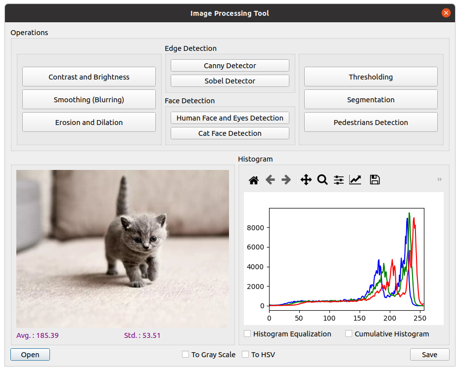
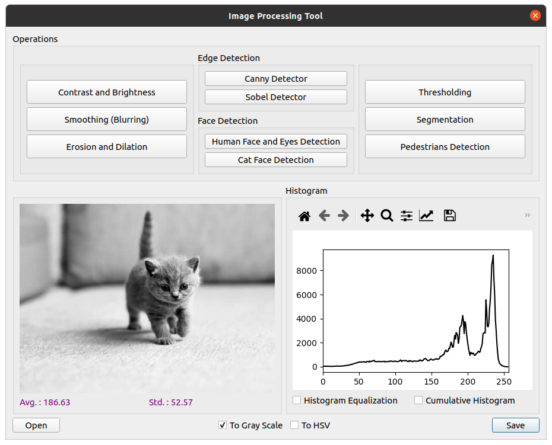
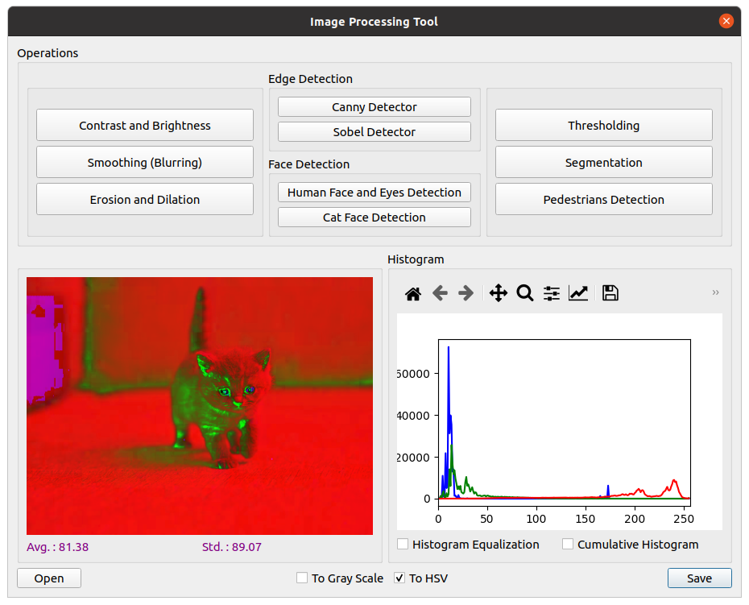
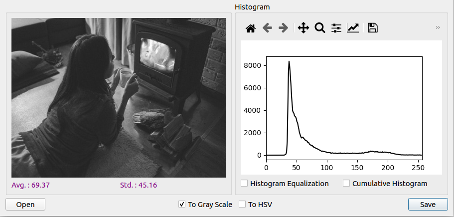
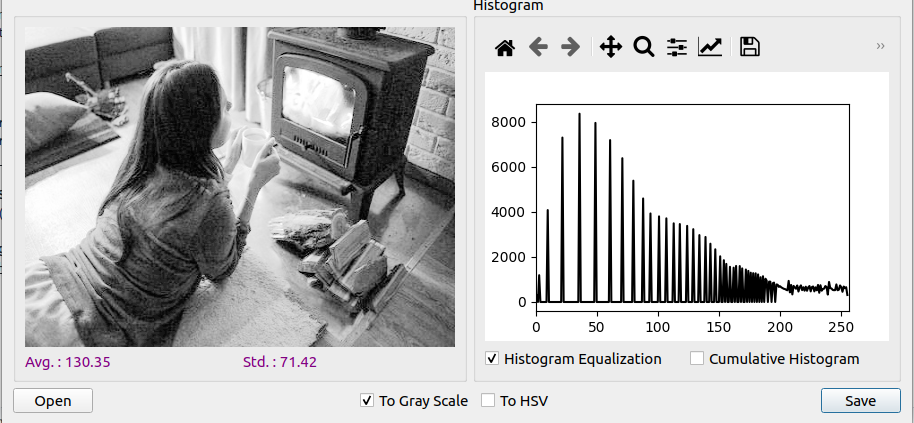
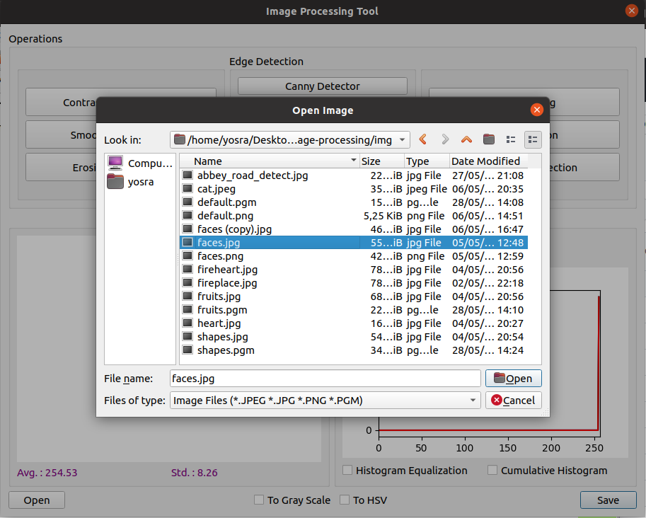
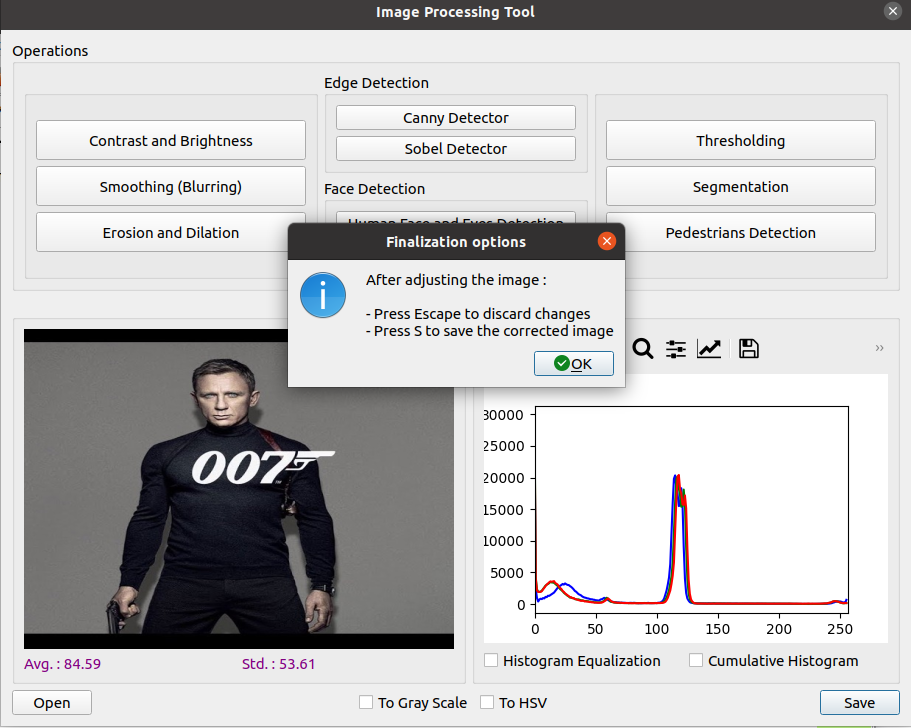

# Image Processing Tool

A graphical tool for image processing.

### Functionalities implemented 

* Basic I/O operations : open and save an image
* Statistics (Average, Std, Histogram, ...)
* Conversion to Gray Scale or to HSV
* Detection of edges (canny and sobel detector), faces (haar cascade classfier) and people (hog classifier)
* Segmentation using k-Means
* Threshodling
* Erosion & Dilation using as structuring elements : Rectangle, Ellipse and Cross 
* Smoothing (Blurring) using Median, Gaussian and Average Blur
* Modifcation of  Brightness & Contrast

### Conversions
#### To Gray Scale

#### To HSV

### Histogram Equalization
**Before**

**After**

### Basic I/O
#### Open an image

#### Save options

### Contrast and Brightness

